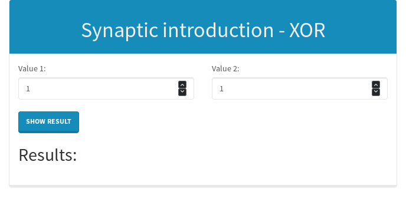

# Introduction to Machine Learning with Javascript using SynapticJS

Simple introduction to Machine Learning world using Javascript and SynapticJS

* Equation XOR

 

## Visit [Blog](http://laesporadelhongo.com/, "My Blog")
&copy; 2017 - Gabriel Cueto <@Mushr00m_Dev>